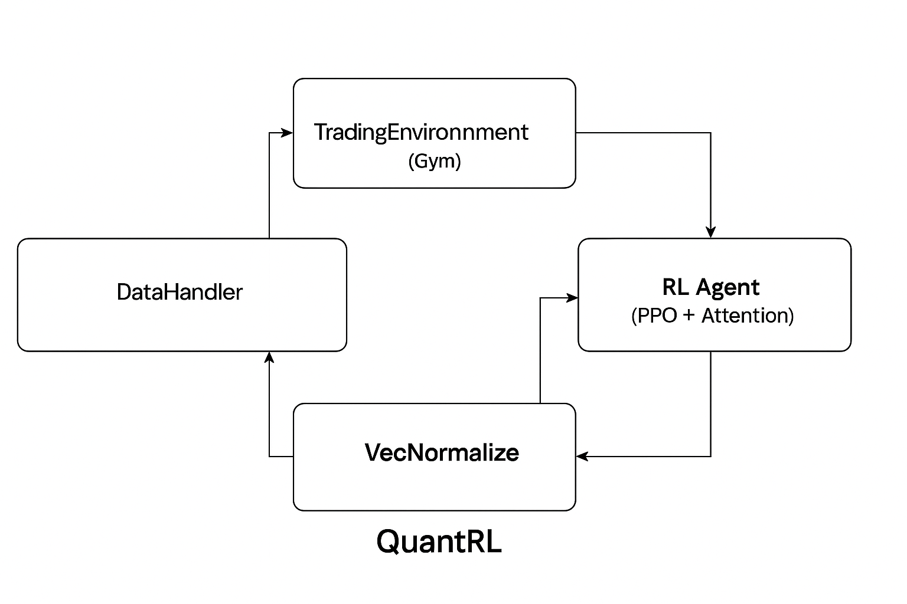
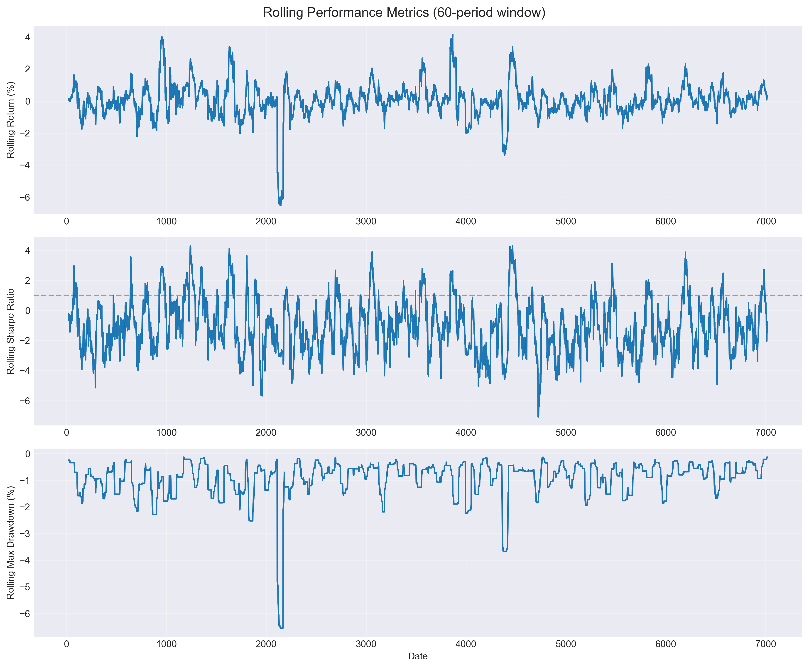
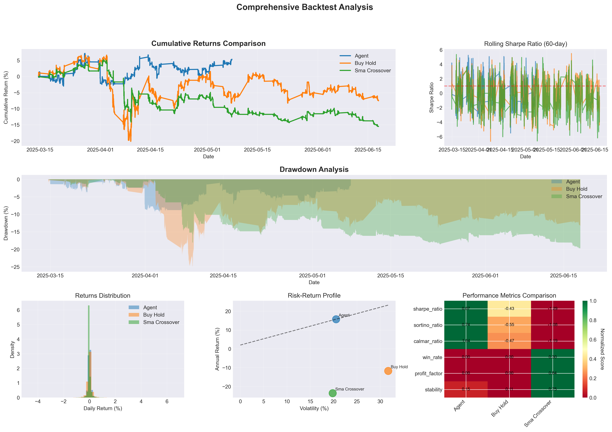
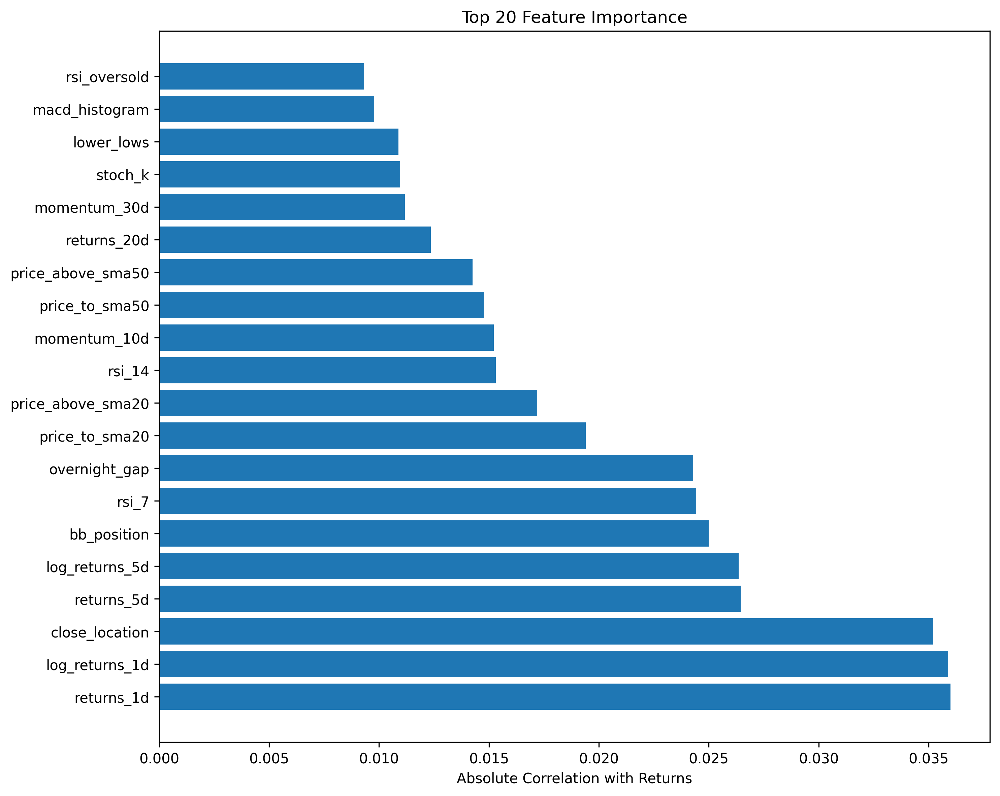

# QuantRL: Deep Reinforcement Learning System for Algorithmic Trading

QuantRL is a modular, research-grade reinforcement learning (RL) framework designed to model, train, and evaluate AI-based trading agents in a realistic financial environment. It is built around the Proximal Policy Optimization (PPO) algorithm using a custom self-attention neural network architecture and incorporates feature-rich market simulation, advanced backtesting, and performance evaluation.

---

## System Architecture Overview
The diagram illustrates QuantRL’s core training loop: historical market data is processed by the `DataHandler`, passed through a `VecNormalize` wrapper, and fed into a custom `TradingEnvironment` built on OpenAI Gym. The PPO-based `RL Agent`, enhanced with a self-attention policy network, interacts with the environment and updates its strategy through repeated episodes. This modular pipeline enables flexible experimentation and rigorous evaluation.



## Key Features

### End-to-End Research Pipeline
- Historical OHLCV data ingestion from CSV or `yfinance`
- 50+ engineered features, including:
  - Price-based indicators (returns, momentum, log returns)
  - Technical signals (RSI, MACD, Bollinger Bands, ATR, ADX)
  - Market structure metrics (volatility regimes, microstructure signals)
  - Time-of-day and session-based features (intraday structure)
- Normalization options: standard, min-max, and robust scaling
- Temporal train/validation/test split to ensure realistic evaluation

### Custom OpenAI Gym Environment
- Discrete and continuous action support
- Position sizing logic (fixed, Kelly criterion, volatility-scaling)
- Simulates slippage, transaction cost, drawdown, volatility penalty
- Tracks portfolio metrics: unrealized/realized PnL, Sharpe ratio, drawdown, win rate, trade counts

### Reinforcement Learning Agent
- Built on `stable-baselines3` PPO with custom enhancements:
  - Self-attention neural architecture (`TradingNetworkV2`)
  - Modular market vs. portfolio feature separation
  - Residual connections, dropout, and layer normalization
  - Attention applied to market feature embeddings
- Optional ensemble model support for strategy robustness
- Supports training callbacks, checkpointing, and post-training analysis

### Comprehensive Backtesting
- Benchmark strategies: Buy-and-Hold, SMA crossover, Momentum
- Agent testing includes walk-forward and Monte Carlo simulation
- 30+ performance metrics tracked across evaluation periods
- Visualizations: equity curves, rolling Sharpe ratio, drawdown plots, trade analysis

### CLI and Reproducibility
- Modular `main.py` orchestrates data loading, training, backtesting, and reporting
- YAML/JSON config for hyperparameters and architecture
- Random seeding for deterministic experiments
- Output folder includes saved models, logs, plots, and reports

---

## Sample Backtest Results (on AAPL 5-min data, 5 years)

This framework is in active development and not fully optimized. The backtest below was performed using an early version of the agent trained on limited data and compute resources.

- Cumulative Return: ~5.4%
- Sharpe Ratio: ~0.67
- Sortino Ratio: ~0.74
- Calmar Ratio: ~1.64
- Max Drawdown: ~7.1%
- Win Rate: ~54%
- Trades Executed: ~280
- Average Position Duration: 30–45 minutes

Further improvements are expected with larger datasets, longer training schedules, and hyperparameter tuning.

---

### Visual Results

**Rolling Performance Metrics**  
Tracks rolling return, Sharpe ratio, and max drawdown over time.



**Comprehensive Backtest Analysis**  
Benchmarks the RL agent against SMA crossover and Buy & Hold strategies.



**Top 20 Feature Importance**  
Ranked by absolute correlation with future returns.



---

## Repository Structure

```
RL-Trading-System/
├── main.py                 # Pipeline entry point
├── data_handler.py         # Feature engineering and data loading
├── trading_environment.py  # Custom Gym environment
├── rl_agent.py             # PPO agent and attention network
├── backtester.py           # Backtesting utilities
├── utils.py                # Logging, config parsing, visualizations
├── requirements.txt
└── /output                 # Logs, models, metrics (excluded via .gitignore)
```

---

## Dependencies

- Python 3.8+
- `torch`, `stable-baselines3`, `gymnasium`
- `numpy`, `pandas`, `scikit-learn`, `matplotlib`, `seaborn`
- `tensorboard` (for training logs)
- `optuna` (optional, for hyperparameter optimization)

Install with:

```
pip install -r requirements.txt
```

---

## Future Work

This system is modular and built with extensibility in mind. Planned enhancements include:

- Multi-asset support and dynamic asset selection
- Live data streaming and inference deployment
- Extended reward shaping using NLP-based sentiment indicators
- Expanded ensemble methods with regime-aware meta-agent routing
- Alpha signal evaluation under production constraints

---

## Notes

This project was developed independently to demonstrate production-level engineering, modern AI integration, and creativity in quantitative modeling. While the current agent is functional and well-instrumented, profitability metrics will improve with access to more compute and richer data.

---

## Author

Amin Sharifi  
Quantitative Researcher | AI/ML Developer | PhD Composer
Email: info@masharifi.com
Website: https://www.masharifi.com  
Linkedin: https://www.linkedin.com/in/amin-sharifi-062a477b
GitHub: https://github.com/amin-sharifi-github/quant-rl-trading-agent
